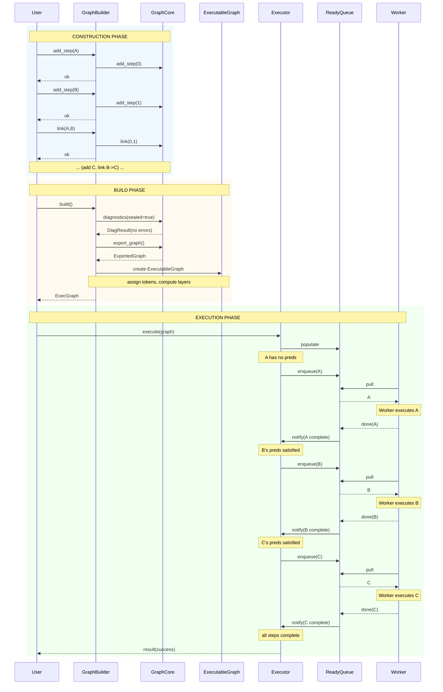
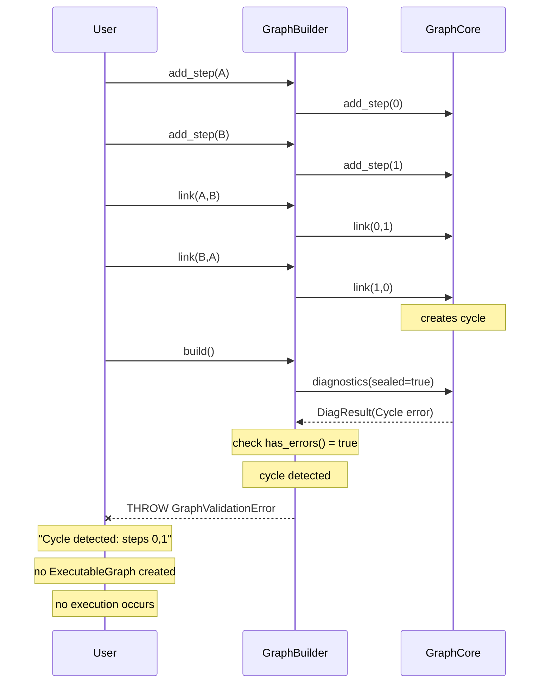
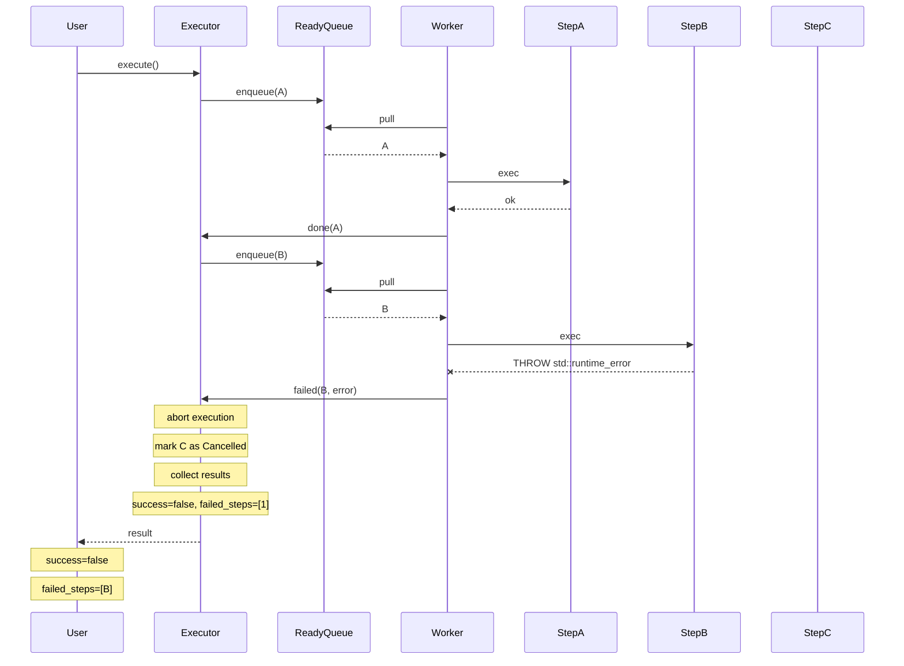
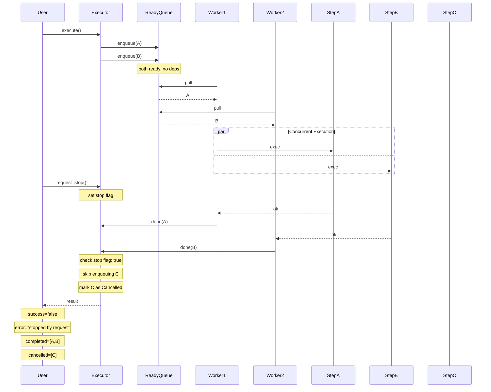
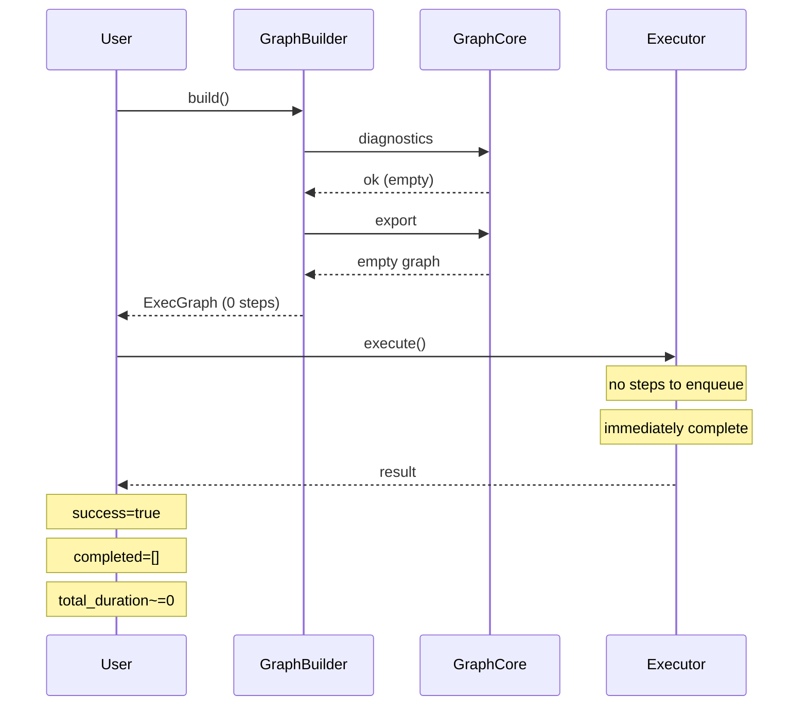
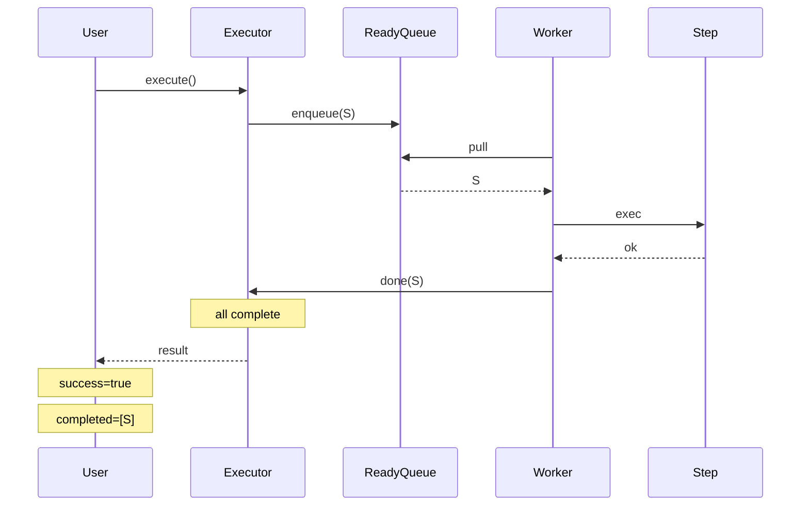
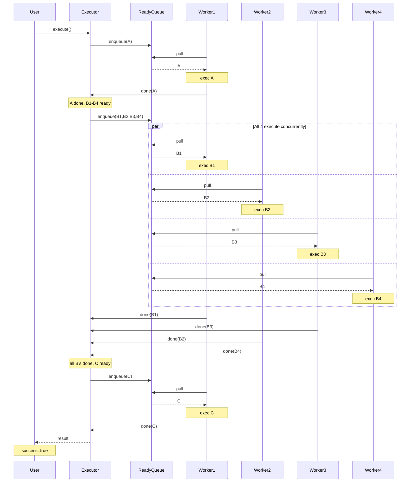
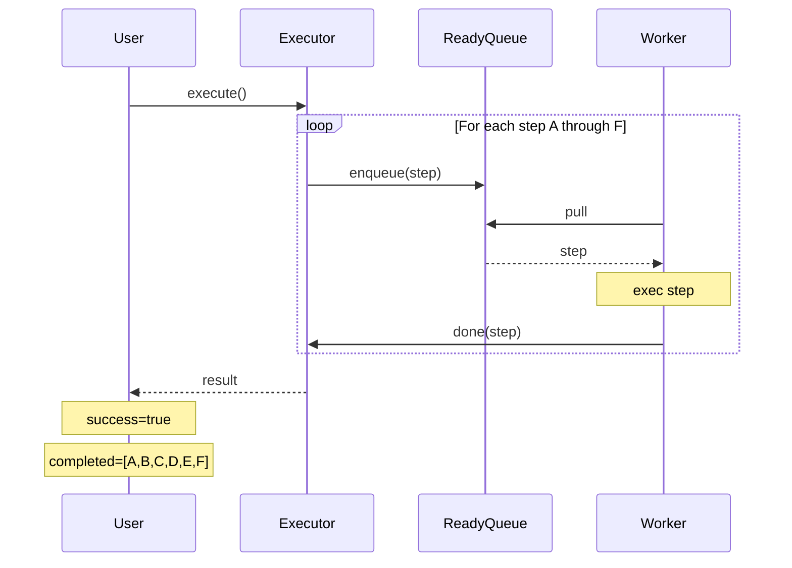
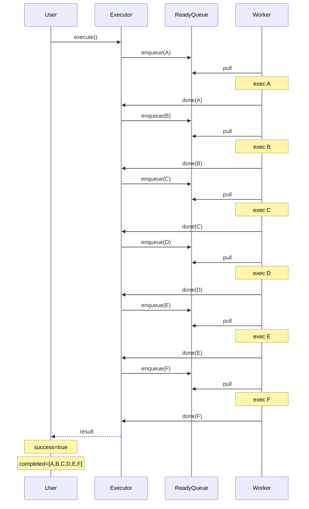
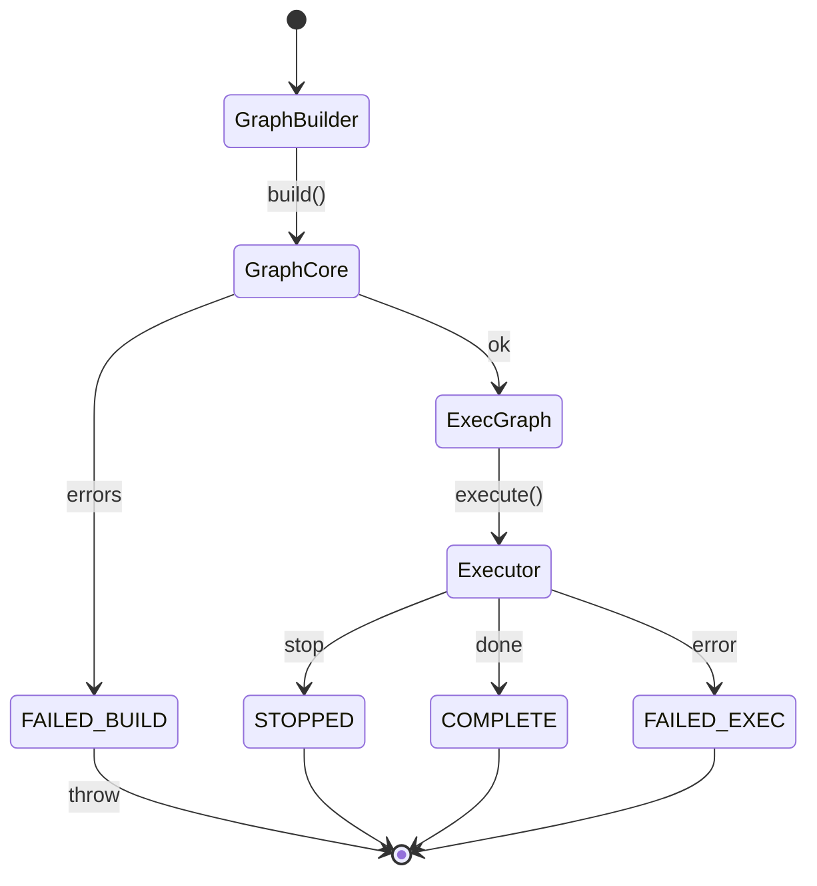

# 2026-01-13_101343_execution_interaction_graph_level_mermaid.md

## Header

- **Title:** Execution Interaction Diagrams: Graph Level (Mermaid)
- **Author:** Claude (AI) with human direction
- **Date:** 2026-01-13 (America/Los_Angeles)
- **Document Status:** Active
- **Related:**
  - `2026-01-13_095409_execution_interaction_graph_level.md` (ASCII version)
  - `2026-01-13_095410_execution_interaction_step_level.md`
  - `2026-01-13_095411_execution_interaction_data_flow.md`
  - `2026-01-12_203411_task_execution_roadmap.md`

---

## Purpose

This document illustrates the graph-level execution lifecycle through chronological interaction diagrams using **Mermaid**. It is a companion to the ASCII version and covers the same scenarios.

**Note:** These diagrams are design exploration, not authoritative specifications. The actual execution model uses a single task submission queue with variable workers pulling prerequisite-satisfied tasks.

---

## Actors

| Actor | Responsibility |
|-------|----------------|
| **User** | Application code that defines and executes graphs |
| **GraphBuilder** | Bridges user objects to index-based GraphCore |
| **GraphCore** | Index-based DAG validation and export |
| **ExecutableGraph** | Immutable execution plan with objects and ordering |
| **Executor** | Manages execution lifecycle and worker coordination |
| **ReadyQueue** | Thread-safe queue of prerequisite-satisfied tasks |
| **Worker** | Thread that pulls and executes tasks |

---

## Scenario 1: Successful Execution (Happy Path)

A graph with steps A->B->C executes successfully.

---

## Scenario 2: Validation Failure at build()

Graph has a cycle (A->B->A), detected during build().

**Notes:**
- Validation happens eagerly at build() time
- User receives structured error with involved steps
- No resources allocated for execution

---

## Scenario 3: Step Failure During Execution

Step B throws an exception during execute().

**Notes:**
- First failure triggers abort (configurable behavior in future)
- Pending steps (C) are marked Cancelled, not executed
- Worker catches exception, reports to Executor
- Result contains which step failed and error message

---

## Scenario 4: Stop Request (Graceful Shutdown)

User requests stop while execution is in progress.

**Notes:**
- In-progress steps (A, B) complete normally
- Pending steps (C) are not started, marked Cancelled
- Stop is cooperative, not preemptive
- Result indicates partial completion

---

## Scenario 5: Empty Graph Execution

Graph has no steps.

**Notes:**
- Empty graph is valid (no cycles, no errors)
- Execution completes immediately
- Result indicates success with zero steps

---

## Scenario 6: Single-Step Graph

Graph has exactly one step with no dependencies.

**Notes:**
- Simplest non-empty case
- Single step is immediately ready (no predecessors)
- Completes after one worker execution

---

## Scenario 7: Wide Parallel Graph (Many Concurrent Steps)

Graph: A -> {B1, B2, B3, B4} -> C (fan-out, fan-in)

**Notes:**
- Multiple workers can execute concurrently
- B1-B4 all become ready when A completes (fan-out)
- C waits for all B's to complete (fan-in / join)
- Worker assignment is non-deterministic

---

## Scenario 8: Deep Sequential Graph (Long Dependency Chain)

Graph: A -> B -> C -> D -> E -> F (6 steps in sequence)

**Expanded view:**

**Notes:**
- No parallelism possible (each step depends on previous)
- Multiple workers won't help throughput
- Demonstrates worst-case for parallel execution
- Total time = sum of individual step times

---

## Summary: Graph-Level State Transitions

---

## References

- `2026-01-13_095409_execution_interaction_graph_level.md` - ASCII version of this document
- `2026-01-12_203411_task_execution_roadmap.md` - Execution phases
- `2026-01-12_215134_design_defects_and_pitfalls.md` - Known issues
